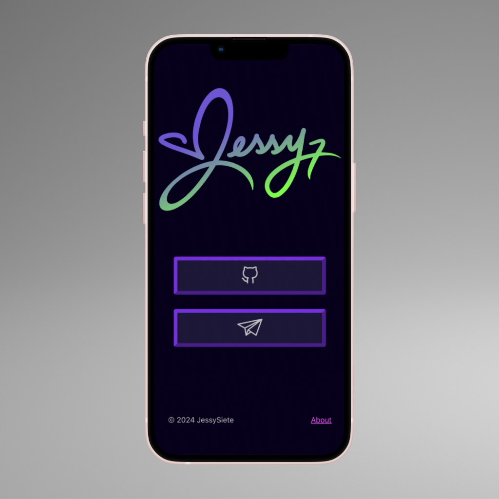

<h1 align="center">
  JessySiete
</h1>

    A responsive no-frills landing page.

### Solving for
- A lightweight & scalable landing page for a personal portfolio.
- An upgraded & active learning playground.
- A new email address @ my domain pointing to an active page.

### Development
I chose Vite to scaffold this project for its lightweight dependencies, fast-build capabilities, as well as its current day relevance and resources.

Additionally, I needed an upgrade! My first React projects were coded using sandboxes and, the now depreciated, <code>npm create-react-app</code>. 
 

### Credits
🏗️ Built using [Vite + React](https://github.com/SafdarJamal/vite-template-react) template with [degit](https://github.com/Rich-Harris/degit).
🔲 Button icons are from the [Noun Project](https://thenounproject.com).
💻 MPB mockup template is from [Figma](https://www.figma.com/community/file/1162016271988369755/free-macbook-pro-16-mockups).
📱 iPhone13 mockup template is also from [Figma](https://www.figma.com/community/file/1024660344079637299/iphone-13-pro-iphone-13-mockups).
🖋️ Procreate used to draw the script logo, vectorized with Inkscape.
🛸 Deployed using Heroku CLI

<!-- Deployed using Heroku CLI -->
<!-- ## License -->